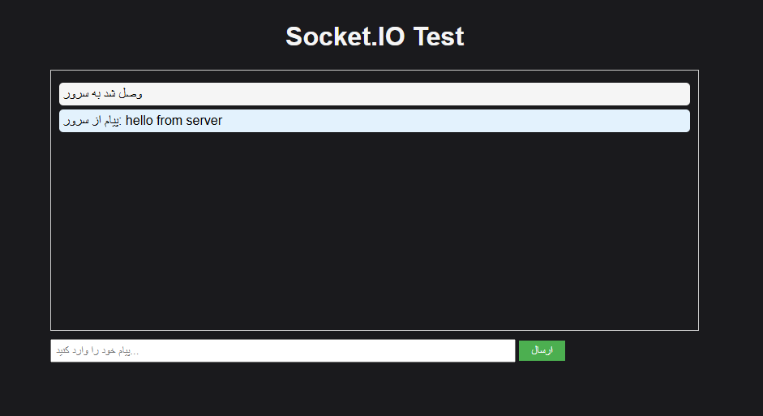

# socket.io

---

<h3>get source code and run :</h3>

`git clone https://github.com/JJalireza/socket.io.git`

`cd cd socket.io`

`npm i`

`node server.js`

---

<h3>If you are using Docker, you can pull the image :</h3>

`docker pull italireza/message-socket:1.0.2`

<h3>docker run -d -p 3000:3000 italireza/message-socket:1.0.2</h3>

---
